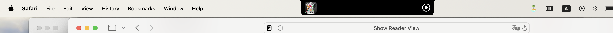
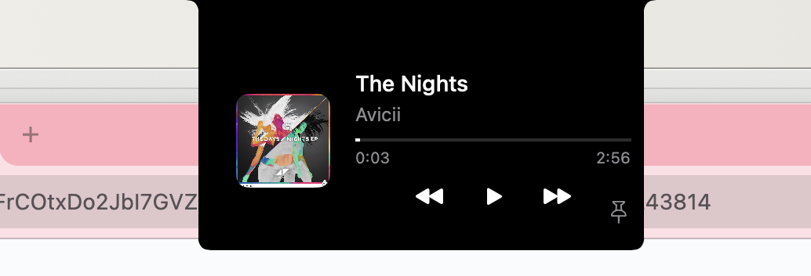

# macOS Floating Island

A Dynamic Island-inspired interface element for macOS, bringing the innovative iOS feature to your Mac desktop.

## Overview

macOS Floating Island recreates the seamless, interactive notification and status display experience of iOS's Dynamic Island for the macOS environment. It provides a sleek, non-intrusive way to view and interact with system notifications, media controls, and active background processes.

## Features

- 🎵 Media playback controls and Now Playing information

## Usage
Option 1
1. Compile the project in Xcode by opening the FloatingIsland.xcodeproj file
2. Run the app

Option 2
I checked in an unsigned executable FloatingIsland.app. Run this directly if you don't want to compile the project.
Note: When users try to run an unsigned app, they'll see security warnings and will need to:

Right-click the app and select "Open"
Click "Open" in the security dialog
Or go to System Preferences → Security & Privacy → General → Click "Open Anyway"

## License

This project is licensed under the MIT License - see the [LICENSE](LICENSE) file for details.

## Acknowledgments

- Inspired by Apple's Dynamic Island on iOS
- Built with SwiftUI and AppKit
- Icons provided by [SF Symbols](https://developer.apple.com/sf-symbols/)

---

Made with ❤️ for the macOS community